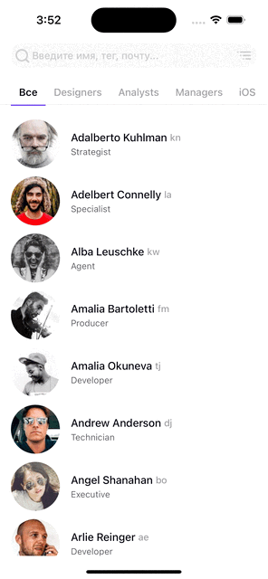

# CODETest 

CODETest — это учебный iOS-проект разработанный на Swift с использованием архитектуры MVVM. Реализует приложение для отображения списка сотрудников компании, поиск и связь с ними. 

## 📌 Основные функции

- Получение и отображение данных с использованием сетевых запросов
- Обработка и отображение информации в таблице
- Фильтр сотрудников по отделам
- Сортировка по дате рождения и алфавиту
- Поиск среди сотрудников
- Просмотр информации сотрудников
- Возможность связи с выбранным сотрудником


## 📱 Демонстрация функциональности

Ниже представлены основные возможности приложения:

### 🧭 Фильтрация по отделам  
Позволяет отфильтровать сотрудников по выбранному отделу.  


---

### 🔍 Поиск сотрудников  
Поиск по имени, фамилии или нику.  


---

### ↕️ Сортировка списка  
Сортировка по алфавиту (по умолчанию) или по дню рождения.  


### 👤 Информация сотрудника 
Просмотр информации о сутруднике и звонок по контактному номеру телефона.



---

## 🧰 Технологии

- Swift
- UIKit
- MVVM
- Xib
- URLSession
- URLCache
- GCD

## 🚀 Установка

1. Клонируйте репозиторий:

   ```bash
   git clone https://github.com/KristelWhite/code_Test.git
   ```
2. Чтобы проект скомпилировался, выполните в терминале в директории проекта:

    ```bash
    pod init
    pod install
    
3. Откройте проект в Xcode.
4. Запустите на симуляторе или устройстве.

## 📂 Структура проекта

- `Application/` — точка входа и конфигурация приложения
- `Controllers/` — контроллеры представлений
- `Logic/` — бизнес-логика и обработка данных
- `Model/` — модели данных
- `Network/` — сетевые запросы и обработка ответов
- `Constants.swift` — константы, используемые в проекте

## 🎓 Полученные навыки

- Освоила базовую структуру MVVM и принципы её применения
- Научилась разделять ответственность между слоями: View, ViewModel и Model
- Отделила функциональную логику от интерфейса в статический класс
- Прокачала работу с `URLSession` и декодингом JSON
- Кешировала данные запроса с `URLCash`
- Получила опыт работы с асинхронными вызовами и обработкой ошибок
- Освоила передачу данных между контроллерами через протоколы и делегаты без segue
- Создала интерфейс через Xib

## ⏱ Оценка времени и реальное исполнение

Ожиданиемое время на весь проект составляло 30 часов, а в итоге заняло около 50 часов, так как в процессе программирования было изначально принято решение использовать внешний фреймворк для отрисовки вью выбора категорий, но в процессе было решено использовать стандартные библиотеки. Также, какое-то время было потрачено на баги и поиск ошибок в логике, поиск лучших решений для создания ui и соответствие его дизайну. К тому же некоторые задачи, например написание ui из кода являлась для меня новой задачей и я смогла частично это осуществить.

Указанное время является примерным, и не вмещает в себя всю работу над проектом.


| Задача                                                            | Ожидаемое время | Фактическое время |
|-------------------------------------------------------------------| :-:|:-:|
| Планирование задач                                                | 1 | 2 |
| Модель данных для получения информации с сервера                  | 1 | 2 |
| Настройка работы с сервером (Networking)                          | 1 | 1 |
| Тестирование полученных данных                                    | 20 минут | 30 минут  |
| Настроить Кеш для функции получения списка работников             | 20 минут | 30 минут |
| Функция загрузки фото с URL с кешированием                        | 1 | 1 |
|  |  |  |
| Поиск подхода для создания UI главного экрана                     | 2 | ∞ |
| Добавление таблицы работников на главный экран                    | 30 минут | 1 |
| Дизайн ячейки работника таблицы                                   | 30 минут | 1.5 |
| Переформатирование даты для отображения в ячейке на экране        | 30 минут | 30 минут |
| Добавление заслонки для фотографии, которая не загружена          | 10 минут | 20 минут |
|  |  |  |
| Добавление и настройка внешнего вида поиска на главный экран      | 1 | 2 |
| Добавление поиска в navigation bar                                | 10 минут | ∞ |
| Изменение цвета кнопок поиска и сортировки                        | 20 минут | 30 минут |
| Логика поиска по имени, фамилии и тегу                            | 30 минут | 40 минут |
| Экран при отсутствии совпадений в поиске                          | 10 минут | 20 минут |
| Добавление в таблицу хедера для отображения следующего года       | 1 | 2 |
| Настройка скрытия и показа даты в зависимости от сортировки       | 10 минут | 20 минут |
|  |  |  |
| Кнопка сортировки и Bottom Sheet экран при нажатии                | 10 минут | 3 (из-за бага) |
| Настроить Header View для отображения заголовка                   | 30 минут | 1 |
| Добавить таблицу для выбора вариантов сортировки                  | 30 минут | 1 |
| Настроить дизайн ячеек таблицы сортировки                         | 30 минут | 1 |
| Настроить механизм выбора только одной ячейки и запоминание выбора| 30 минут | 30 минут |
| Логика сортировки по алфавиту                                     | 10 минут | 10 минут |
| Логика сортировки по дню рождения                                 | 30 минут | 1 |
| Вызов получения данных с сервера при выборе сортировки            | 30 минут | 1 |
|  |  |  |
| Добавление вью для выбора категории                               | 30 минут | 30 минут |
| Настройка коллекции категорий                                     | 30 минут | 1 |
| Добавление логики выбора категории                                | 30 минут | 30 минут |
| Обновление таблицы при выборе коллекции                           | 30 минут | 1 |
| Размеры и дизайн ячеек коллекции (при выборе и по умолчанию)      | 30 минут | 2 |
| Добавление сепаратора для отделения категории от таблицы работников| 30 минут | 1 |
| Добавление плавающей линии и анимации выбора коллекции            | 2 | 2 |
|  |  |  |
| Создание контроллера с информацией о работнике и добавление на него таблицы| 1 | 2 |
| Создание хедера и настройка его вида                              | 1 | 3 |
| Создание двух ячеек таблицы с датой рождения и телефоном          | 1 | 2 |
| Приведение даты рождения к корректному виду и получение количества лет работника| 30 минут | 1 |
| Action Sheet для вызова номера телефона                           | 1 | 2 |
| Кастомизация кнопки назад                                         | 30 минут | 30 минут |
|  |  | |
| Логика сортировки, фильтрации и выбора по категории и ее оптимизация| 1 | 3 |
| Pull-to-refresh для таблицы работников на главном экране| 30 минут | 1.5 |
| Установить иконки приложения| 10 минут | 20 минут |
| Залить на гит| 10 минут | ∞ |

Знак ∞ обозначает, что задача заняла гораздо больше времени чем от нее ожидалось


